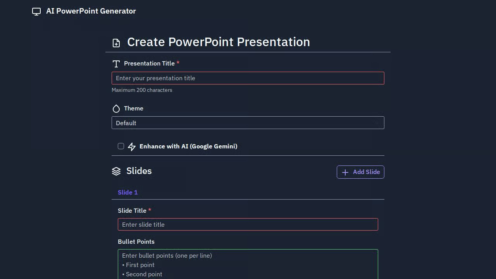

# AI PowerPoint Generator

<div align="center">
  
  <br>
  <em>Generate professional PowerPoint presentations with AI-powered content enhancement</em>
</div>

<div align="center">
  
  
  
  
  
  
</div>

## 🤖 About This Project

**AI PowerPoint Generator** is a sophisticated Flask web application that revolutionizes presentation creation by leveraging cutting-edge AI technology. Built with modern Python architecture and Google's Gemini AI, this tool transforms basic content into professional, engaging PowerPoint presentations.

### 🚀 Key Technical Features

- **AI-Powered Content Enhancement**: Utilizes Google Gemini 2.5 Pro for intelligent content polishing, expansion, and speaker note generation
- **Multi-Modal AI Integration**: Combines text processing with image suggestion capabilities via Pexels API
- **Professional Theme Engine**: 5 pre-built themes (Default, Dark, Corporate, Modern, Vibrant) with customizable color schemes and typography
- **Dynamic Content Generation**: Supports unlimited slides with real-time AI enhancement modes
- **Image Intelligence**: AI-suggested relevant images based on slide content analysis
- **Enterprise-Grade Architecture**: Modular service-based design with comprehensive error handling and logging

### 🛠️ Technical Stack

- **Backend**: Flask 2.0+ with Blueprint architecture
- **AI Engine**: Google Gemini 2.5 Pro with structured JSON responses
- **Presentation Engine**: python-pptx with custom theme rendering
- **Image Processing**: PIL/Pillow for format conversion and optimization
- **API Integration**: Pexels API for intelligent image suggestions
- **Validation**: Pydantic models for robust data validation
- **Testing**: pytest framework with comprehensive test coverage

### 🎯 AI Enhancement Modes

1. **Polish Mode**: Refines existing content for clarity and professionalism
2. **Expand Mode**: Generates additional bullet points and content suggestions
3. **Notes Mode**: Creates comprehensive speaker notes for each slide
4. **Image Suggestions**: AI-powered keyword extraction for relevant imagery

### 📊 Performance & Scalability

- **Modular Architecture**: Service-based design for easy maintenance and scaling
- **Memory Efficient**: Streaming file processing with temporary file management
- **Error Resilience**: Comprehensive error handling with graceful fallbacks
- **Security**: Environment-based configuration with secure API key management

## 🚀 Quick Start

```bash
# Clone the repository
git clone https://github.com/AdityaShukla2315/AI-Presentation-Generator.git
cd AI-Presentation-Generator

# Install dependencies
pip install -r AI_PowerPoint_Generator/requirements.txt

# Set up environment variables
cp .env.example .env
# Edit .env with your API keys

# Run the application
cd AI_PowerPoint_Generator
flask --app app run --host 0.0.0.0 --port 5000
```

## ✨ Features

- **Simple Web Interface**: Clean, responsive HTML form for creating presentations
- **AI Enhancement**: Use Google Gemini to improve slide content, add speaker notes, and generate additional bullet points
- **Multiple Themes**: Choose from various presentation themes (Default, Dark, Corporate, Modern, Vibrant)
- **Image Support**: Add images via URL upload or get AI-suggested images from Pexels
- **Flexible Content**: Support for multiple slides with customizable titles and bullet points
- **PowerPoint Export**: Generate and download professional .pptx files

## Setup

### Prerequisites

- Python 3.11 or higher
- Google Gemini API key
- (Optional) Pexels API key for image suggestions

### Installation

1. **Create virtual environment**:
   ```bash
   python -m venv .venv
   source .venv/bin/activate  # On Windows: .venv\Scripts\activate
   ```

2. **Install dependencies**:
   ```bash
   pip install flask python-pptx google-genai requests python-dotenv pytest
   ```

3. **Configure environment variables**:
   ```bash
   cp .env.example .env
   ```
   
   Edit `.env` and add your API keys:
   ```
   GEMINI_API_KEY=your_gemini_api_key_here
   PEXELS_API_KEY=your_pexels_api_key_here
   SESSION_SECRET=your_session_secret_here
   MAX_UPLOAD_MB=5
   MODEL_NAME=gemini-2.5-pro
   GEMINI_TEMPERATURE=0.4
   ```

4. **Get API Keys**:
   - **Gemini API Key**: Get from [Google AI Studio](https://aistudio.google.com/app/apikey)
   - **Pexels API Key** (optional): Get from [Pexels API](https://www.pexels.com/api/)

## Usage

### Running the Application

```bash
flask --app app run --host 0.0.0.0 --port 5000
```

### Web Interface

1. Open your browser and navigate to `http://localhost:5000`
2. Fill in the presentation details:
   - **Title**: Your presentation title
   - **Theme**: Choose from available themes
   - **Slides**: Add slide titles and bullet points
   - **Images**: Add image URLs or use AI-suggested images
3. Click "Generate Presentation" to create your PowerPoint
4. Download the generated .pptx file

## 🎨 Showcase

### AI Enhancement Capabilities
- **Content Polish**: Transform basic bullet points into professional, engaging content
- **Smart Expansion**: Generate additional relevant points using AI analysis
- **Speaker Notes**: Automatically create comprehensive speaking notes
- **Image Intelligence**: AI-suggested relevant images for each slide

### Professional Themes
- **Default**: Clean, professional appearance
- **Dark**: Modern dark theme for contemporary presentations
- **Corporate**: Business-focused design with corporate colors
- **Modern**: Sleek, minimalist design
- **Vibrant**: Colorful, engaging theme for creative presentations

## 📁 Project Structure

```
AI_PowerPoint_Generator/
├── app.py                 # Flask application factory
├── main.py               # Application entry point
├── models.py             # Pydantic data models
├── routes.py             # Flask routes and views
├── services/             # Core business logic
│   ├── gemini.py         # Google Gemini AI integration
│   ├── ppt_generator.py  # PowerPoint generation engine
│   ├── images.py         # Image processing & Pexels API
│   ├── themes.py         # Theme management system
│   └── validators.py     # Input validation & sanitization
├── templates/            # Jinja2 HTML templates
├── static/              # CSS, JavaScript, and assets
└── tests/               # Comprehensive test suite
```

## API Integration

### Google Gemini
- **Purpose**: Content enhancement and AI-powered suggestions
- **Features**: 
  - Improve slide content
  - Generate additional bullet points
  - Add speaker notes
  - Suggest presentation improvements

### Pexels API (Optional)
- **Purpose**: AI-suggested images for presentations
- **Features**: 
  - Relevant image suggestions based on slide content
  - High-quality stock photos
  - Automatic image integration

## 🤝 Contributing

We welcome contributions from the community! Here's how you can help:

### 🐛 Bug Reports
- Use the GitHub issue tracker
- Include detailed steps to reproduce
- Provide error logs and system information

### 💡 Feature Requests
- Describe the feature and its use case
- Consider implementation complexity
- Check existing issues for duplicates

### 🔧 Development Setup
1. Fork the repository
2. Create a feature branch (`git checkout -b feature/amazing-feature`)
3. Install development dependencies: `pip install -r requirements.txt`
4. Run tests: `pytest tests/`
5. Make your changes with proper documentation
6. Commit your changes (`git commit -m 'Add amazing feature'`)
7. Push to the branch (`git push origin feature/amazing-feature`)
8. Open a Pull Request with detailed description

### 📋 Code Standards
- Follow PEP 8 style guidelines
- Add type hints for new functions
- Include docstrings for public methods
- Write tests for new features
- Update documentation as needed

## License

This project is licensed under the MIT License - see the [LICENSE](LICENSE) file for details.

## 🗺️ Roadmap

### Upcoming Features
- **Multi-language Support**: Generate presentations in multiple languages
- **Advanced Templates**: Pre-built presentation templates for common use cases
- **Collaboration Tools**: Real-time collaborative editing capabilities
- **Export Options**: Support for PDF, Keynote, and Google Slides formats
- **Analytics Dashboard**: Track presentation performance and engagement
- **Custom Branding**: Upload company logos and custom color schemes

### Technical Improvements
- **Performance Optimization**: Caching and async processing for faster generation
- **Mobile Responsiveness**: Enhanced mobile interface for on-the-go creation
- **API Endpoints**: RESTful API for third-party integrations
- **Docker Support**: Containerized deployment for easy scaling

## 🙏 Acknowledgments

- **[Google Gemini](https://aistudio.google.com/)** - Advanced AI capabilities and content enhancement
- **[Pexels](https://www.pexels.com/)** - High-quality stock photos and image suggestions
- **[python-pptx](https://python-pptx.readthedocs.io/)** - Robust PowerPoint generation library
- **[Flask](https://flask.palletsprojects.com/)** - Lightweight and flexible web framework
- **[Pydantic](https://pydantic-docs.helpmanual.io/)** - Data validation and settings management
